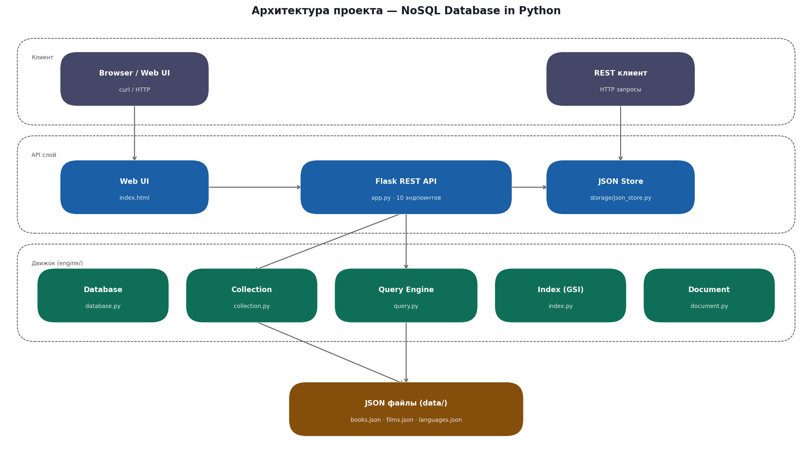
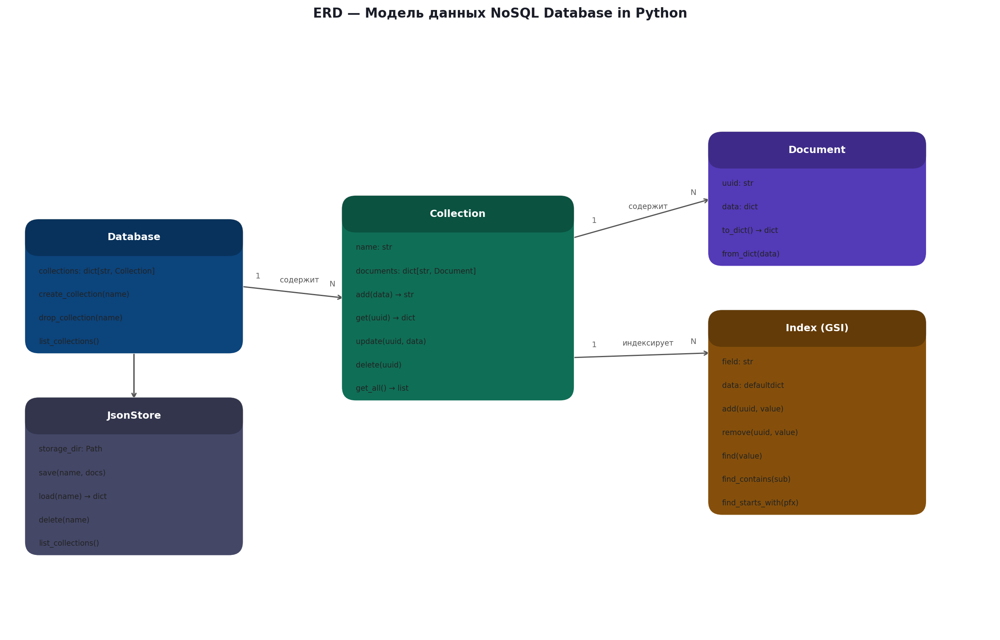
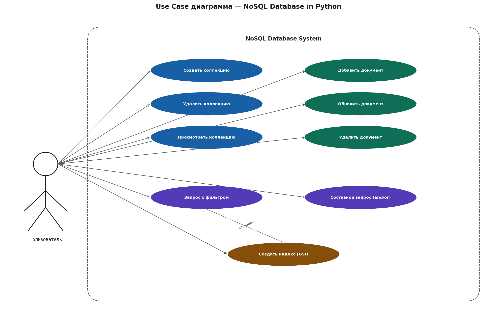
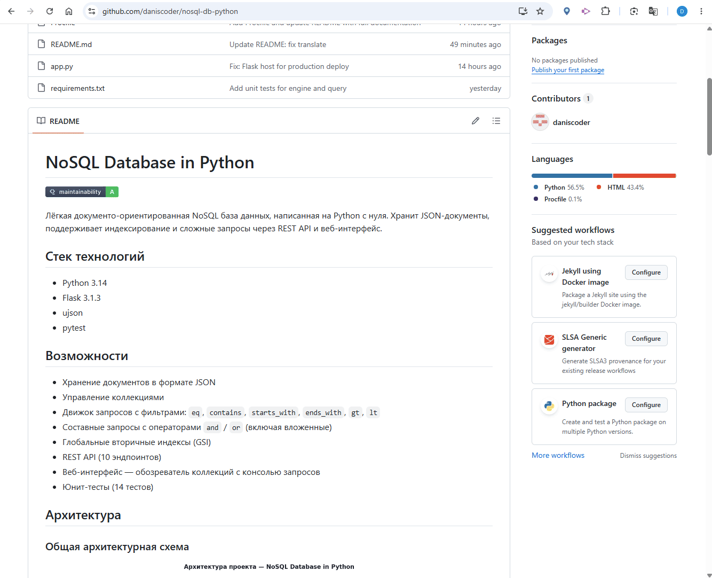

# NoSQL База данных на Python

[](https://qlty.sh/gh/daniscoder/projects/nosql-db-python)

Лёгкая документо-ориентированная NoSQL база данных, написанная на Python с нуля.
Хранит JSON-документы, поддерживает индексирование и сложные запросы через REST API и веб-интерфейс.

## Стек технологий

- Python 3.14
- Flask 3.1.3
- ujson
- pytest

## Возможности

- Хранение документов в формате JSON
- Управление коллекциями
- Движок запросов с фильтрами: `eq`, `contains`, `starts_with`, `ends_with`, `gt`, `lt`
- Составные запросы с операторами `and` / `or` (включая вложенные)
- Глобальные вторичные индексы (GSI)
- REST API (10 эндпоинтов)
- Веб-интерфейс — обозреватель коллекций с консолью запросов
- Юнит-тесты (14 тестов)

## Архитектура

### Общая архитектурная схема


### Модель данных (ERD)


### Use Case диаграмма


## Структура проекта

```
nosql-db-python/
├── assets/
│   ├── architecture.png  # Архитектурная схема
│   ├── erd.png           # Модель данных (ERD)
│   ├── usecase.png       # Use Case диаграмма
│   └── demo.gif          # Демонстрация
├── data/
│   ├── books.json        # Тестовые данные
│   ├── films.json        # Тестовые данные
│   └── language.json     # Тестовые данные
├── engine/
│   ├── collection.py     # Управление коллекциями
│   ├── database.py       # Класс базы данных
│   ├── document.py       # Модель документа
│   ├── index.py          # GSI индекс
│   └── query.py          # Движок запросов
├── storage/
│   └── json_store.py     # Слой хранения JSON
├── templates/
│   └── index.html        # Веб-интерфейс
├── tests/
│   └── test_engine.py    # Юнит-тесты
├── app.py                # Flask REST API
├── Procfile              # Конфигурация деплоя Render
└── requirements.txt
```

## Запуск локально

```bash
pip install -r requirements.txt
python app.py
```

## API

| Метод  | URL                      | Описание                    |
|--------|--------------------------|-----------------------------|
| GET    | /db/collections          | Список коллекций            |
| POST   | /db/collections          | Создать коллекцию           |
| DELETE | /db/collections/{name}   | Удалить коллекцию           |
| POST   | /db/{col}/documents      | Добавить документ           |
| GET    | /db/{col}/documents      | Все документы коллекции     |
| GET    | /db/{col}/documents/{id} | Найти документ по UUID      |
| PUT    | /db/{col}/documents/{id} | Обновить документ           |
| DELETE | /db/{col}/documents/{id} | Удалить документ            |
| POST   | /db/{col}/query          | Запрос с фильтрами          |
| POST   | /db/{col}/index          | Создать индекс              |

## Хранение данных

Приложение использует слой хранения на основе JSON-файлов. Три коллекции по умолчанию (`films`, `books` и `language`) включены в репозиторий и загружаются автоматически при запуске.

> **Примечание:** На бесплатном плане Render файловая система эфемерна — коллекции, созданные или изменённые во время работы, будут удалены при перезапуске. Коллекции по умолчанию всегда восстанавливаются из репозитория.

## Демонстрация



## Примеры запросов

**Добавить документ** — POST `/db/{col}/documents`:
```json
{
  "name": "Python",
  "typing": "dynamic",
  "year": 1991,
  "popular": true
}
```

**Простой запрос** — POST `/db/{col}/query`:
```json
{
  "query": {"typing": {"eq": "static"}},
  "limit": 10
}
```

**Запрос contains с сортировкой**:
```json
{
  "query": {"name": {"contains": "Script"}},
  "limit": 10,
  "sort_by": "year"
}
```

**Составной запрос and**:
```json
{
  "query": {
    "and": [
      {"typing": {"eq": "static"}},
      {"year": {"gt": 2010}}
    ]
  },
  "sort_by": "year"
}
```

**Вложенный запрос or/and**:
```json
{
  "query": {
    "or": [
      {
        "and": [
          {"typing": {"eq": "static"}},
          {"popular": {"eq": "true"}}
        ]
      },
      {"year": {"lt": 2000}}
    ]
  }
}
```

## Деплой

https://nosql-db-python.onrender.com

## Источники

- Туториал: https://jamesg.blog/2024/08/19/nosql-database-python
- Каталог: https://github.com/practical-tutorials/project-based-learning